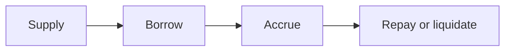

# How it works

Meridiant is a set of independent lending markets. In each market, one asset is supplied and borrowed; another asset is posted as collateral. Interest is paid by borrowers and earned by suppliers. If a loan becomes unsafe, anyone can close it.

Nothing here is under-collateralized, and nothing spans more than one market.

## The loop

1. **A market is created** with a collateral asset, a loan asset, a price source, and a risk profile (how much you may borrow, when a loan is unsafe, and how interest responds to demand).
2. **Suppliers deposit** the loan asset. That liquidity is what borrowers draw from.
3. **Borrowers lock collateral** — still in their ownership — and take out a loan smaller than the collateral is worth.
4. **Interest accrues** as the book is used. When more of the pool is borrowed, rates rise.
5. **Borrowers repay** to reduce or close the loan. Full repayment releases the collateral.
6. **If a position falls below its safety line**, anyone may repay it and receive discounted collateral. That is how the pool stays solvent without a trusted closer.

## Over-collateralized, always

A borrower cannot take out more than the market allows against the current value of their collateral. That ceiling is conservative on purpose. Prices move; a buffer is what keeps the pool whole when they do.

The protocol checks a fresh price at the moment a loan is opened or liquidated. It does not act on a stale quote.

## What a position looks like

From a borrower's point of view: collateral locked, debt outstanding, and a health level that compares the two. Health is private to the borrower and the protocol.

From a supplier's point of view: a claim on the pool. As borrowers pay interest, that claim is worth more of the loan asset. Withdrawals are limited to liquidity that is not currently lent out.

## What the protocol does *not* do

- It does not take your collateral into a shared vault it owns.
- It does not mix one market's liquidity with another's.
- It does not require a privileged actor to liquidate an unsafe loan.
- It does not publish your size, your health, or your identity to the network.

The next pages walk through markets, supplying, borrowing, liquidation, prices, and rates — still at the product level, not the implementation.
